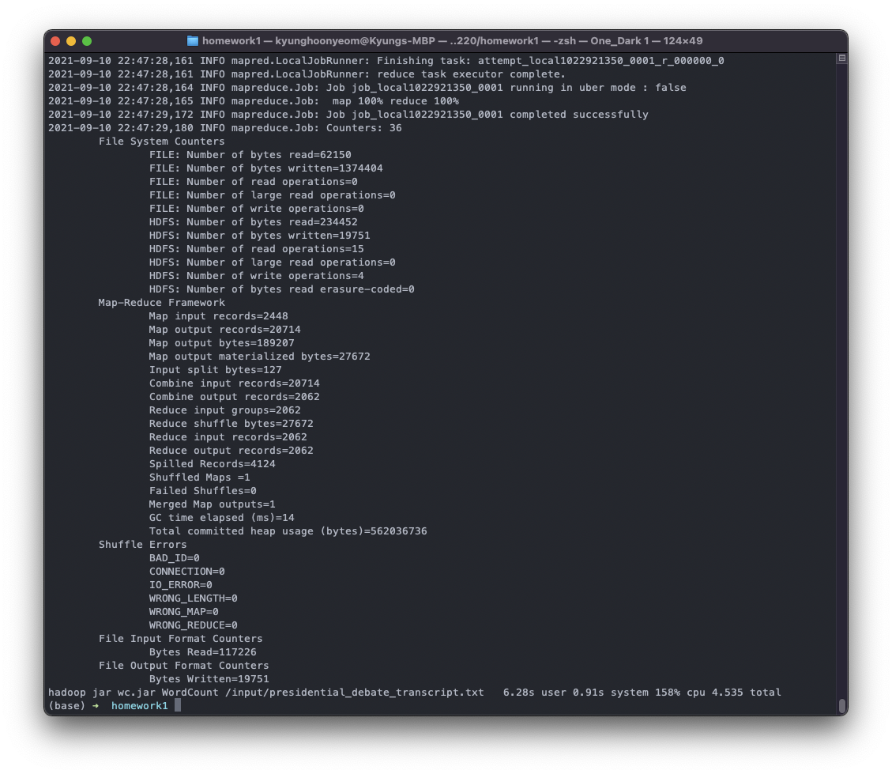
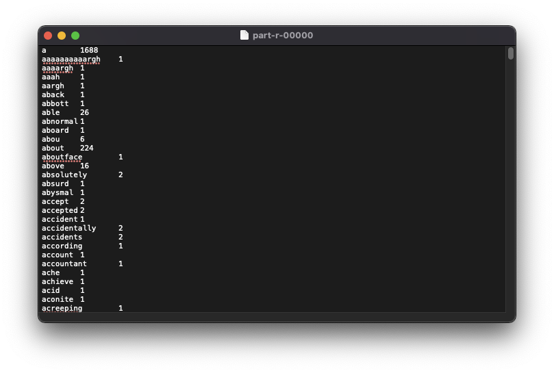
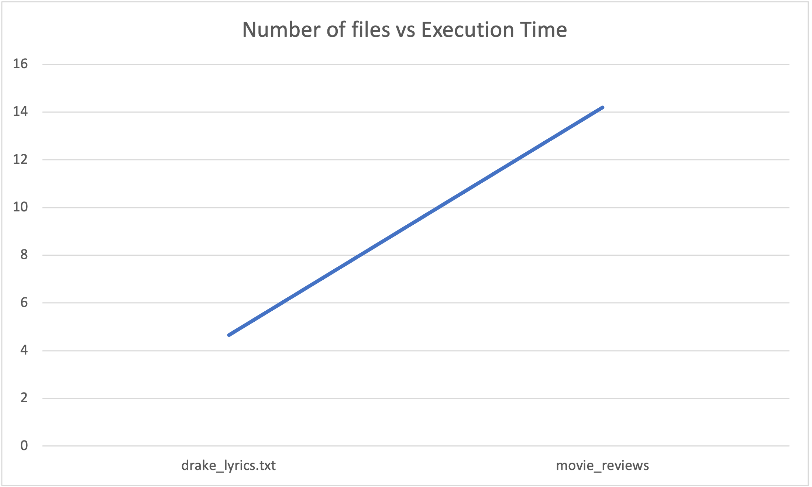
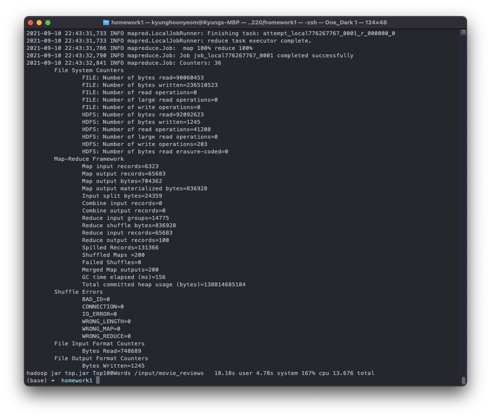
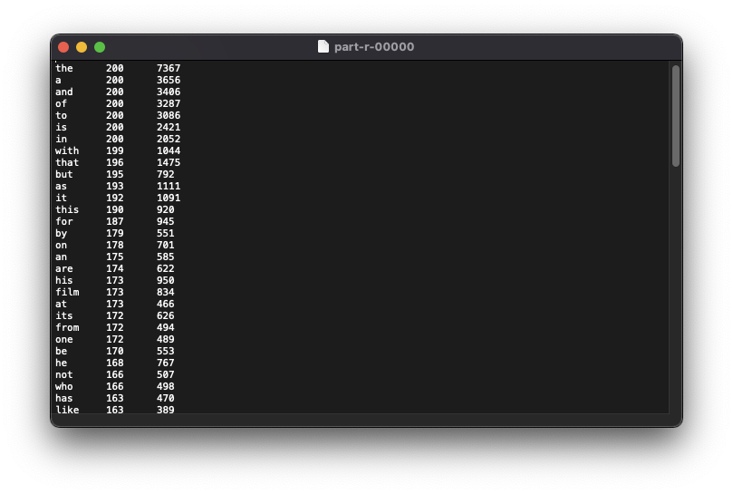
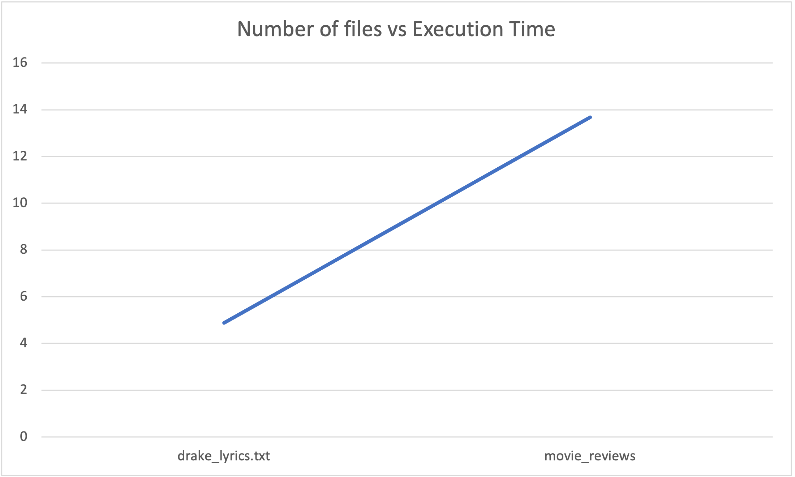

# Homework Assignment 1 (Programming Category)
Student Name: Kyung Hoon Yeom

Student Session: CS6220-A
## Problem 1 - Option 1

https://github.com/kyunghoonyeom/CS-6220/tree/main/Assignment1
---
### Install Hadoop

* Followed https://medium.com/beeranddiapers/installing-hadoop-on-mac-a9a3649dbc4d

---
### Word Count
* WordCount.java
   * Revised https://hadoop.apache.org/docs/stable/hadoop-mapreduce-client/hadoop-mapreduce-client-core/MapReduceTutorial.html#Example:_WordCount_v1.0 to remove all punctuations

In order to compile the java file:

    hadoop com.sun.tools.javac.Main WordCount.java
    jar cf wc.jar WordCount*.class

After compiling, use __.jar__ file to run each program:

    hadoop jar wc.jar WordCount /input/harry_potter.txt /output/WordCount/harry_potter

    hadoop jar wc.jar WordCount /input/presidential_debate_transcript.txt /output/WordCount/presidential_debate_transcript

    hadoop jar wc.jar WordCount /input/drake_lyrics.txt /output/WordCount/drake_lyrics

    hadoop jar wc.jar WordCount /input/hiphop_lyrics /output/WordCount/hiphop_lyrics

    hadoop jar wc.jar WordCount /input/movie_reviews /output/WordCount/movie_reviews

### Dataset (Input)
In order to copy the input files from local file system to HDFS :

    hadoop fs -copyFromLocal ./input /input

* drake_lyrics.txt
    - 775 KB
    - https://www.kaggle.com/juicobowley/drake-lyrics
* harry_potter.txt
    - 432 KB
    - https://www.kaggle.com/santiviquez/hp1txt
* presidential_debate_transcript.txt
    - 114 KB
    - https://www.kaggle.com/gpreda/usa-presidential-debate-2020
* hiphop_lyrics/
    - 7.3 MB total
    - 38 text files
    - https://www.kaggle.com/rikdifos/rap-lyrics
* movie_reviews/
    - 767 KB total
    - 200 text files
    - Used total of 200 text files of 100 pros and 100 cons.
    * http://www.cs.cornell.edu/people/pabo/movie-review-data/

### Screenshot

### Output
In order to copy the output files from HDFS system to local file system:

    hadoop fs -get /output/WordCount ./output/WordCount

### Running Time
Measured running time by using `time` when calling the script for running program

| File Name                          | Number of files | Size of file (KB) | Execution Time (ms) |
| :--------------------------------: | :-------------: | :---------------: | :-----------------: |
| harry_potter.txt                   | 1               | 443               | 4578                |
| presidential_debate_transcript.txt | 1               | 117               | 3896                |
| drake_lyrics.txt                   | 1               | 793               | 4651                |
| hiphop_lyrics                      | 38              | 7316              | 10104               |
| movie_reviews                      | 200             | 767               | 14195               |

 

---
 
### Top 100 Words
*  Top100Words.java
    * Revised **WordCount.java** to print the top 100 words occurring in the most files

In order to compile the java file:

    hadoop com.sun.tools.javac.Main Top100Words.java
    jar cf top.jar Top100Words*.class

After compiling, use __.jar__ file to run each program:

    hadoop jar top.jar Top100Words /input/harry_potter.txt /output/Top100Words/harry_potter

    hadoop jar top.jar Top100Words /input/presidential_debate_transcript.txt /output/Top100Words/presidential_debate_transcript

    hadoop jar top.jar Top100Words /input/drake_lyrics.txt /output/Top100Words/drake_lyrics

    hadoop jar top.jar Top100Words /input/hiphop_lyrics /output/Top100Words/hiphop_lyrics

    hadoop jar top.jar Top100Words /input/movie_reviews /output/Top100Words/movie_reviews

### Dataset (Input)
In order to copy the input files from local file system to HDFS :

    hadoop fs -copyFromLocal ./input /input

* drake_lyrics.txt
    - 775 KB
    - https://www.kaggle.com/juicobowley/drake-lyrics
* harry_potter.txt
    - 432 KB
    - https://www.kaggle.com/santiviquez/hp1txt
* presidential_debate_transcript.txt
    - 114 KB
    - https://www.kaggle.com/gpreda/usa-presidential-debate-2020
* hiphop_lyrics/
    - 7.3 MB total
    - 38 text files
    - https://www.kaggle.com/rikdifos/rap-lyrics
* movie_reviews/
    - 767 KB total
    - 200 text files
    - Used total of 200 text files of 100 pros and 100 cons.
    * http://www.cs.cornell.edu/people/pabo/movie-review-data/

### Screenshot

### Output
In order to copy the output files from HDFS system to local file system:

    hadoop fs -get /output/WordCount ./output

### Running time

Measured running time by using `time` when calling the script for running program

| File Name                          | Number of files | Size of file (KB) | Execution Time (ms) |
| :--------------------------------: | :-------------: | :---------------: | :-----------------: |
| harry_potter.txt                   | 1               | 443               | 3442                |
| presidential_debate_transcript.txt | 1               | 117               | 3428                |
| drake_lyrics.txt                   | 1               | 793               | 4882                |
| hiphop_lyrics                      | 38              | 7316              | 9121                |
| movie_reviews                      | 200             | 767               | 13676               |

 

---
 

## Analysis
I found out this assigment is helpful to get familiar with hadoop in order to process data. I was able to install and set up the environment of hadoop on my macbook. Moreover, I wrote program that counts the number of words in text file and print the top 100 words among multiple files. It was interesting to investigate how the number of files and size of files affect the execution time of the program. Even though sizes of  drake_lyrics.txt and total size of files in movie_reviews directory are similar to each other, total execution time was significantly different due to difference in number of files. However, not only number of the file affects the execution time, but also sizes of the file affects the execution time. I was able to figure out that the number of files impact more on execution time than the size of the file. Although harry_potter.txt and presidential_debate_transcript.txt have different sizes, their execution time were not significant different. I think it is because there is default threshold for hdfs so that small file will be executed in similar time. I believe I should care about this in later assignment that I will try to reduce the number of file to get better execution running time.

Overall, this assignment makes me understanding how MapReduce works and how to write MapReduce program. I am looking forward to using Hadoop for handling big data. Also, I would like to try Spark in some day.
